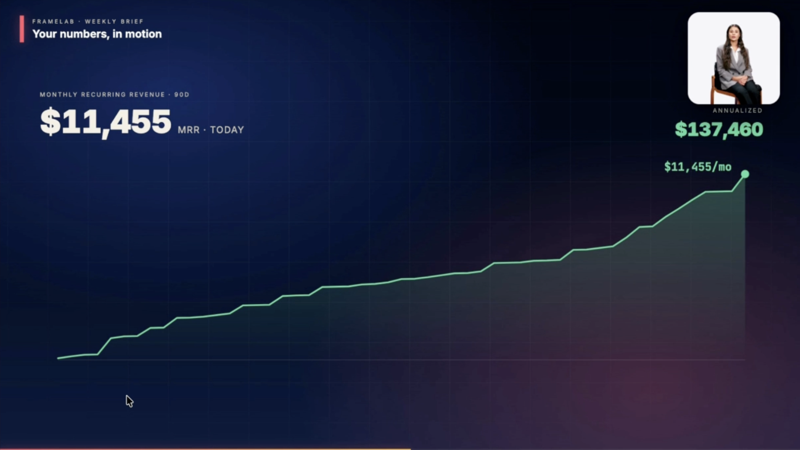
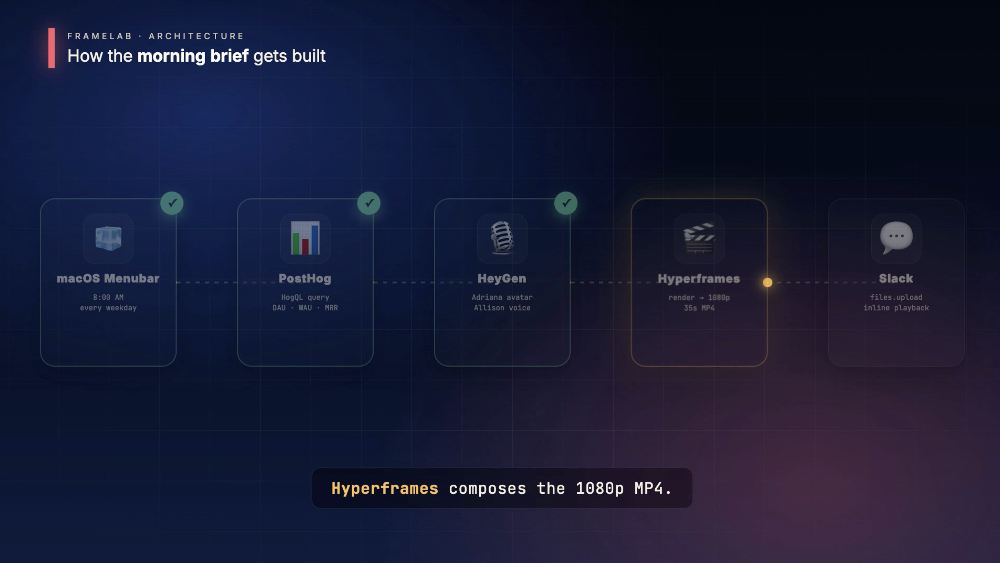

# framelab

**Your weekly metrics, as a 35-second video.**

Every Monday morning at 8 AM, framelab pulls live data from PostHog
(DAU · WAU · MRR · ARR · signups), generates a HeyGen avatar narrator,
composes it with animated charts in Hyperframes, renders a 1920×1080
MP4, and posts it to your team's Slack channel — before anyone's
opened a dashboard.





Built for the **HeyGen Hackathon**, San Francisco, May 14–15, 2026.

---

## The product

A SwiftUI menubar app on macOS. Toggle it on, pick a time, paste a
Slack bot token + channel. Every morning, your team gets the brief.

![Morning brief in Slack — header + KPIs + 35s MP4 inline]

## Stack

- **PostHog** — live event data (HogQL queries: DAU, WAU, MRR ramp, signups)
- **HeyGen** — Adriana avatar + Allison voice via REST API
- **Hyperframes** — HTML+GSAP composition, headless-Chromium render
- **Slack** — `chat.postMessage` + `files.getUploadURLExternal` for inline video
- **SwiftUI MenuBarExtra** — scheduler, generate button, Slack config
- **Next.js 16** — companion web Studio (chat → generate → preview)

## Repo layout

```
.
├── app/, lib/, components/   ← Next.js Studio (chat UI, /api/morning)
├── morning-demo/             ← Hyperframes composition + scripts
│   ├── index.html            ←   the 35s composition (6 beats, 1080p)
│   ├── scripts/
│   │   ├── fetch-series.mjs  ←   PostHog → morning.json → patches HTML
│   │   └── narrate.mjs       ←   HeyGen REST → narrator.mp4 (cached by script hash)
│   └── render.sh             ←   one command: fetch + render
└── macos/                    ← SwiftUI MenuBarExtra app
    └── framelab-macos/
        ├── BriefScheduler.swift   ← daily timer, render process, Slack upload
        └── ContentView.swift      ← popover UI (toggle, schedule, Slack config)
```

## How to run

### 1. Composition (morning-demo)

```bash
cd morning-demo
cp .env.example .env             # POSTHOG_*, HEYGEN_API_KEY
npm install
bash render.sh                   # → renders/morning-demo_<date>.mp4
```

### 2. Web Studio

```bash
cp .env.example .env.local       # POSTHOG_*, HEYGEN_API_KEY
npm install
npm run dev
```

### 3. macOS app

Open `macos/framelab-macos.xcodeproj` in Xcode and ⌘R. The menubar
app spawns `morning-demo/render.sh`, fires a native notification when
ready, and (if enabled) uploads the MP4 to Slack.

To enable Slack delivery:

1. Create a Slack app at api.slack.com with these bot scopes:
   `chat:write`, `chat:write.public`, `files:write`
2. Install to workspace, copy the `xoxb-…` token
3. `/invite @<your-app-name>` into the destination channel
4. Paste the token + channel name into the menubar popover

## How it fits together

```
            ┌────────────────────────────┐
            │  macOS Menubar (8 AM cron) │
            └─────────────┬──────────────┘
                          │ spawns render.sh
                          ▼
   ┌──────────────────────────────────────────────┐
   │ fetch-series.mjs                             │
   │   PostHog HogQL → morning.json               │
   │   patches index.html (const SUMMARY = ...)   │
   └─────────────┬────────────────────────────────┘
                 ▼
   ┌──────────────────────────────────────────────┐
   │ narrate.mjs                                  │
   │   HeyGen /v2/video/generate → narrator.mp4   │
   │   (cached by script hash)                    │
   └─────────────┬────────────────────────────────┘
                 ▼
   ┌──────────────────────────────────────────────┐
   │ npx hyperframes render                       │
   │   headless Chromium → 1920×1080 MP4          │
   └─────────────┬────────────────────────────────┘
                 ▼
   ┌──────────────────────────────────────────────┐
   │ BriefScheduler.postToSlack                   │
   │   chat.postMessage (metrics blocks)          │
   │   files.getUploadURLExternal → PUT → complete│
   └──────────────────────────────────────────────┘
                 ▼
              #northstarmetrics  ✓
```

## Built at

HeyGen Hackathon · San Francisco · May 14–15, 2026
